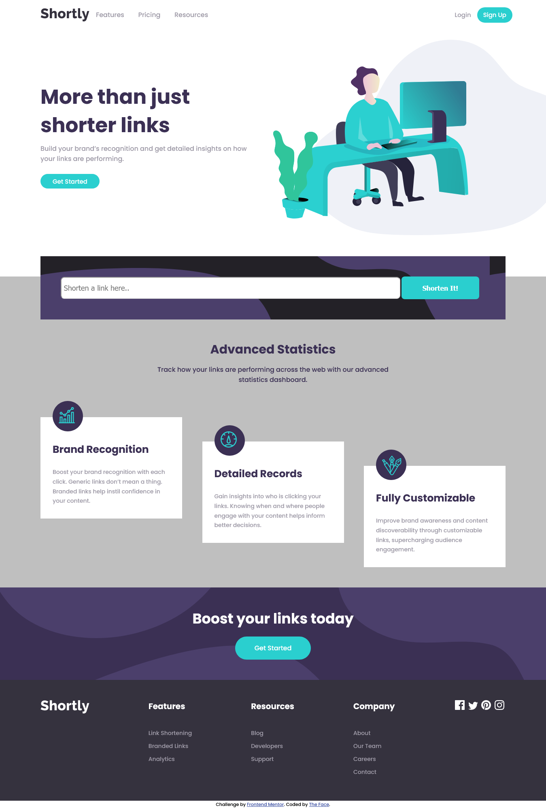

# Frontend Mentor - Shortly URL shortening API Challenge solution

This is my solution to the [Shortly URL shortening API Challenge challenge on Frontend Mentor](https://www.frontendmentor.io/challenges/url-shortening-api-landing-page-2ce3ob-G).

### Screenshot

### Links

- Solution URL: [Visit solution URL](https://www.frontendmentor.io/solutions/shortly-url-shortening-api-challenge-hmbgAhVDg6)
- Live Site URL: [Visit LIVE site](https://thefaceshortener.pages.dev)

### Built with

- Semantic HTML5 markup
- CSS custom properties
- JavaScript

## Author

- Website - [Ezekiel The Face](https://thefaceportfolio.netlify.app)
- Frontend Mentor - [@iamtheface](https://www.frontendmentor.io/profile/iamtheface)
- Twitter - [@thefacetweets](https://www.twitter.com/thefacetweets)
